# Red Dead Redemption 2 Fan Page

This website is intended to provide information in different forms about Rockstars game Red Dead Redemption 2 that was released on different platforms in October 2018.
The intention is to provide a simple website that is easy to navigate, that provides information about the game in video, image and text. There's simple navigations, clear contrast between the colors on the webpage and the background. View the live site here [here](https://hujanen91.github.io/Code_Institute_Project_1/)

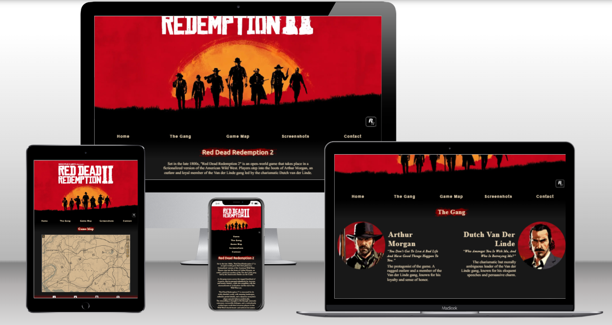

## Features

### Site wide

* Navigation Menu
  * Contains links to the Home, The gang, Screenshots, Game map and Contact pages and will be responsive on all devices.
  * This will allow users to easily navigate between the pages within the site on any size device.


* Header
  
  * The main element that you see when entering the website is a picture designed by Rockstar containing the image of 7 men walking on a row holding guns with the text "Rockstar games presents Red Dead Redemption 2" above them. You'll know immediatly what the website is going to be about. The image sits in the header tag.
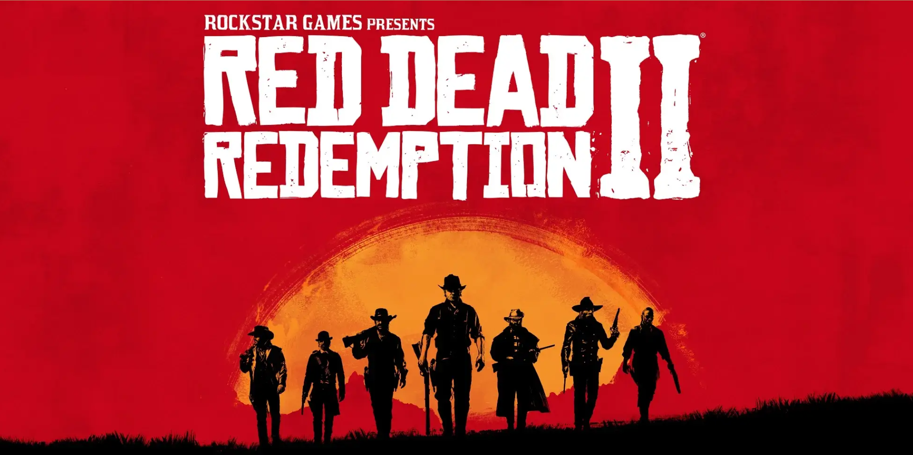

* Footer

  * This will contain icons as links to social media websites that will open in new tabs. Icons will be accessible to the visually impaired who may be using a screen reader, by the use of aria labels.
  * This will allow the user to follow 'Rockstar Games' on various social media where they can get more up to date information that may not be displayed on the website.


* Favicon

  * A site wide favicon will be implemented with Rockstar Games "R" logo that is colored red and designed specifically for the Red Dead Redemption 2 game.
  * This will provide an image in the the tabs header to allow the user to easily identify the website if they have multiple tabs open.

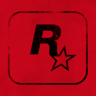

### Landing Page

* Landing page image
  * This will be a big image desinged for the game by Rockstar Games displaying the games name and a few of the characters.
  * This will help to immediately show the user what the website is about and help to animate the page.


* Information about the game to introduce the user to the game straight away.
  * Gametrailer to give the user visual information about the game.
  * Gametrailer is from youtube and Rockstar Games youtube account: <https://www.youtube.com/watch?v=eaW0tYpxyp0>
  * This information lets the user know what the site is about.

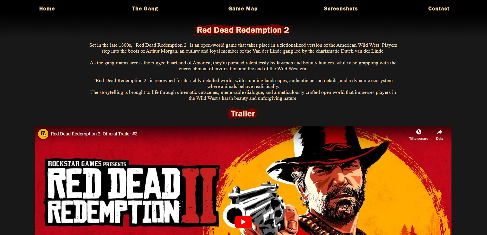

### The Gang

* The Gang
  
  * Divisions with articles containing images,subsections, quotes and paragraphs divided in two columns set to be positioned to the left and right of the page. Scaling it down will make the two columns merge in to one.
  * The articles will display portraits of the gang members and give the user a quote from each carachter and information about each character.

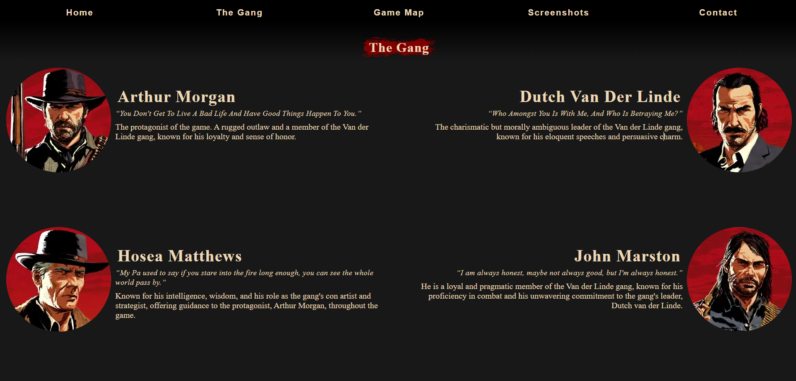
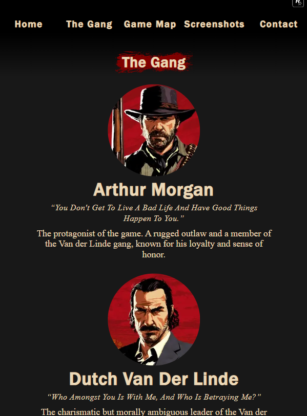

### Game Map

* An interactive map from the game
  
  * Game map will provide the user with an embedded map from the game.
  The map is also interactive to give the user the possibility to go explore the world of the game.
  * The map can display different events, collectibles, animals etc and each icon can be hidden or displayed to make it easier to find what the user is looking for.
  * The map is created by LordfiSh <https://reddeadredemption2map.de/c/#5/-67.867/-59.568>

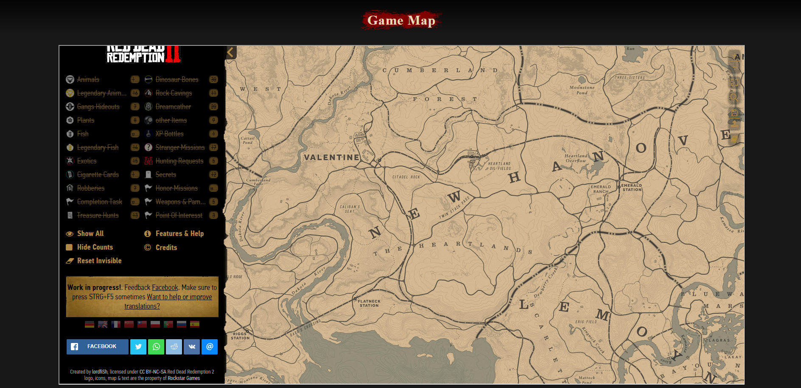

### Screenshots

* A gallery for screenshots
  
  * The Screenshots page will provide the user with a gallery of in-game photos taken by the creator of the page in gameplay. The screenshots gallery will be fully responsive on all devices and allows the user to click each image to open it in a new tab to get a bigger version of the image.
  * This will allow users that are interested in Red Dead Redemption 2 to get a visual insight of the game and it's graphics.

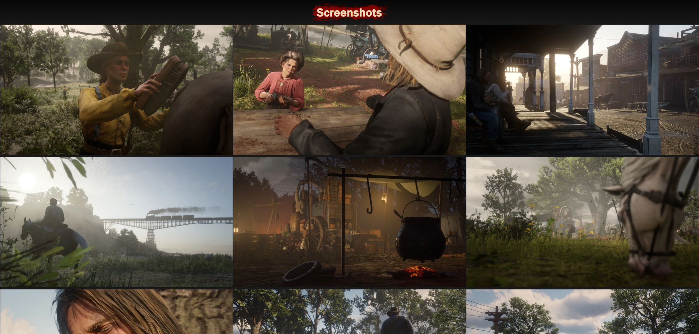

### Contact

* Contact form
  
  * A contact form will be implemented to allow users to contact the creator of the Red Dead Redemption 2 page. The form will consist of the following fields and attributes:
    * First Name (required, type=text)
    * Last Name (required, type=text)
    * Email (required, type=email)
    * Message (required, type=textarea)
  * On successful submission of the contact form, the user will be navigated to contact-thanks.html displaying a image and a thank you message.
  * This will allow the user to contact the creator of Red Dead Redemption 2 if they have any questions or opinions about the website or the game.

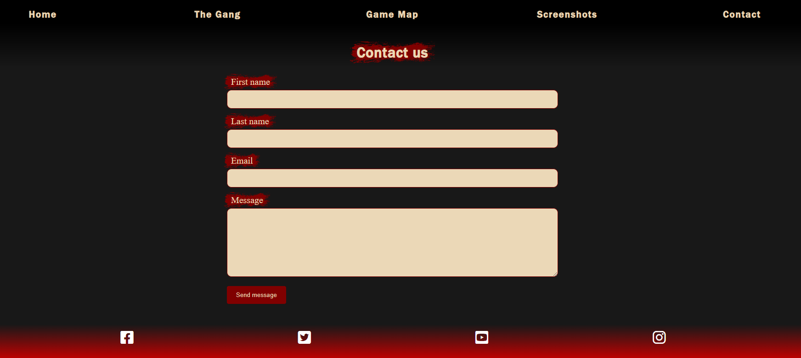
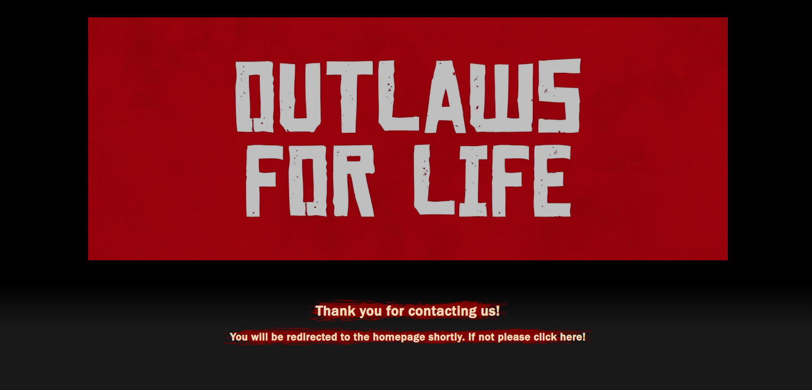

### Existing Features

* Responsive design
* Trailer for the game
* Responsive gallery
* Interactive game map
* Contact form and 'Thank you for contacting us' page
* Socials in footer that opens in new tab

### Features Left to Implement

* More characters in The Gang with image, quote and description
* More images in Screenshots gallery
* Javascript to boost performance in Home and Game Map that has embedded links.
* Create a way for the user to upload their own images from the game
* More pages with more information about the game, tips and tricks, videos with gameplay, information about all the animals in game etc

## Design

### Wireframes

Home page


The Gang Page

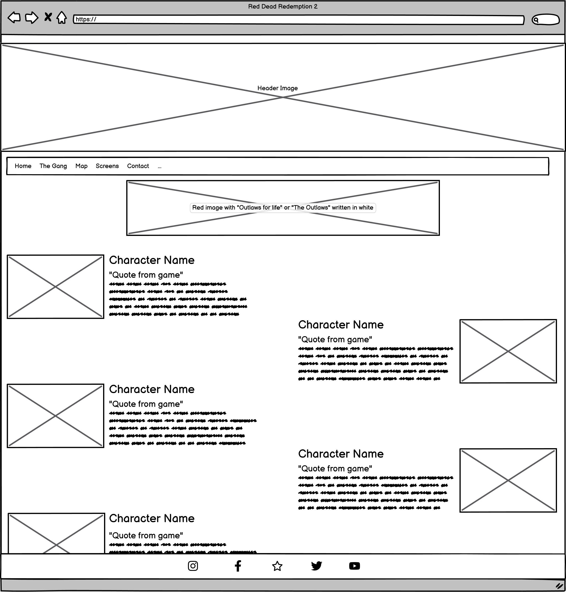


Game Map page


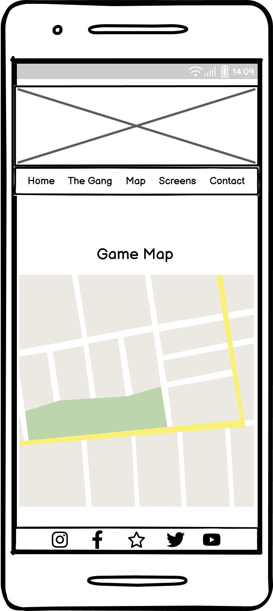

Screenshots page

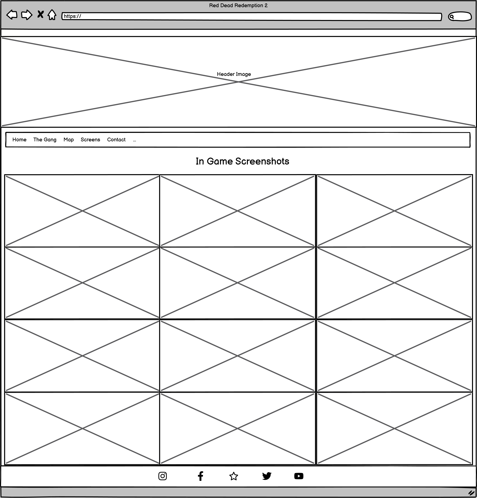


Contact page

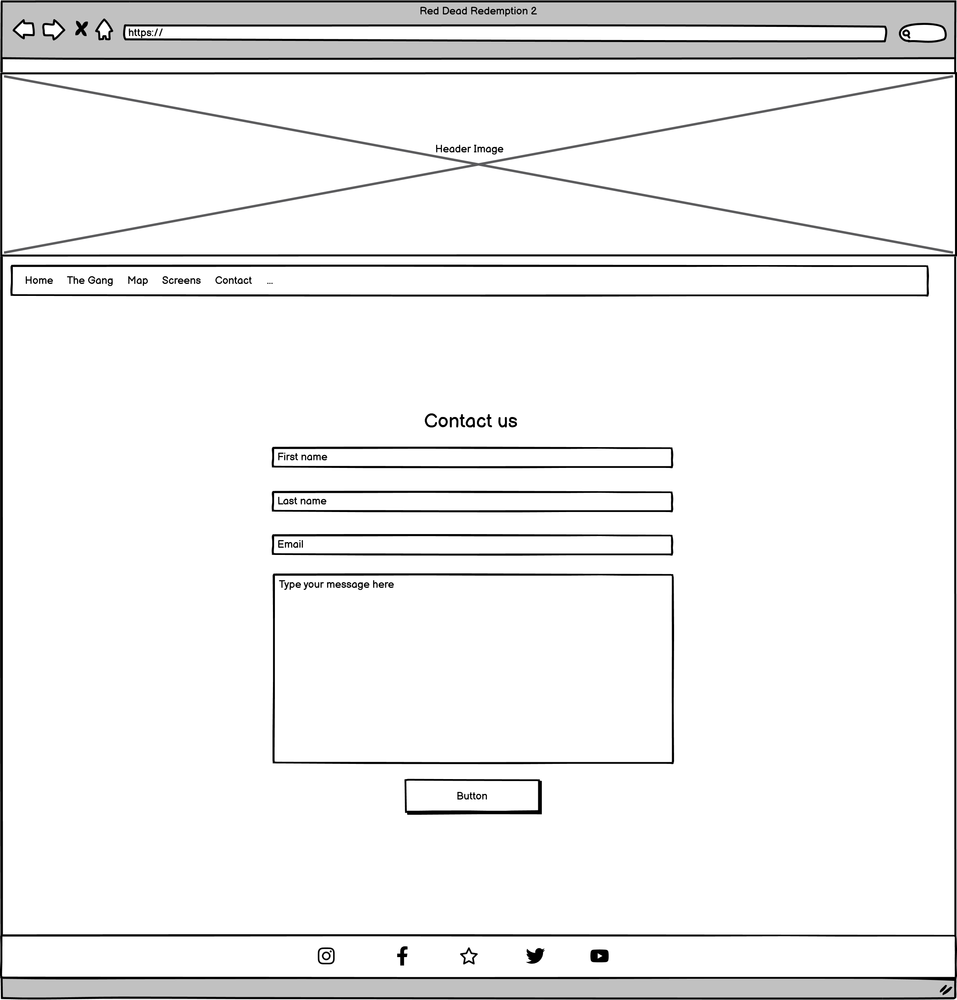
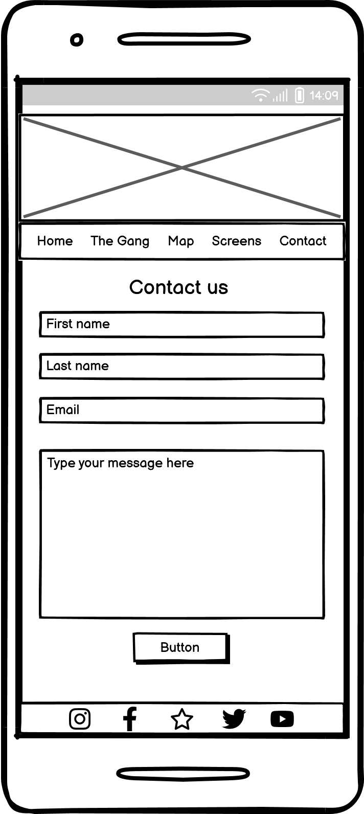

## Technologies

* HTML
  * The structure of the Website was developed using HTML as the main language.
* CSS
  * The Website was styled using custom CSS in an external file.
* Codeanywhere
  * The website was developed using Codeanywhere
* GitHub
  * Source code is hosted on GitHub and delpoyed using Git Pages.
* Git
  * Used to commit and push code during the development of the Website
* Font Awesome
  * Icons obtained from <https://fontawesome.com/> were used as the Social media links in the footer section.
* Pixillion Image Converter
  * Pixillion Image Converter was installed on my computer and used to convert images to .webp
* TinyPNG
  * <https://tinypng.com/> was used to reduce the size of the images used throughout the website
* Favicon.io
  * favicon files were created at <https://favicon.io/favicon-converter/>
* balsamiq
  * wireframes were created using balsamiq from <https://balsamiq.com/wireframes/desktop/#>

## Testing

### Responsiveness

All pages were tested to ensure responsiveness on screen sizes from 320px and upwards as defined in [WCAG 2.1 Reflow criteria for responsive design](https://www.w3.org/WAI/WCAG21/Understanding/reflow.html) on Chrome, Edge, Firefox and Opera browsers.

Steps to test:

1. Open browser and navigate to [Red Dead Redemption 2](https://hujanen91.github.io/Code_Institute_Project_1/)
2. Open the developer tools (right click and inspect)
3. Set to responsive and decrease width to 320px
4. Set the zoom to 50%
5. Click and drag the responsive window to maximum width

Expected:

Website is responsive on all screen sizes and no images are pixelated or stretched.
No horizontal scroll is present.
No elements overlap.

Actual:

Website behaved as expected on every browser and on different devices with the exception of Mozilla Firefox where the brush effect didn't apply as expected [Unfixed Bugs](#unfixed-bugs)

Website was also opened on the following devices and no responsive issues were seen:

* Iphone 13 mini
* Google Pixel 8 pro
* Samsung Galaxy S23 ultra
* Samsung Galaxy S7 Tablet

### Accessibility

[Wave Accessibility](https://wave.webaim.org/) tool was used throughout development and for final testing of the deployed website to check for any aid accessibility testing.

Testing was focused to ensure the following criteria were met:

* All forms have associated labels or aria-labels so that this is read out on a screen reader to users who tab to form inputs
* Color contrasts meet a minimum ratio as specified in [WCAG 2.1 Contrast Guidelines](https://www.w3.org/WAI/WCAG21/Understanding/contrast-minimum.html)
* Heading levels are not missed or skipped to ensure the importance of content is relayed correctly to the end user
* All content is contained within landmarks to ensure ease of use for assistive technology, allowing the user to navigate by page regions
* All not textual content had alternative text or titles so descriptions are read out to screen readers
* HTML page lang attribute has been set
* Aria properties have been implemented correctly
* WCAG 2.1 Coding best practices being followed

Manual tests were also performed to ensure the website was accessible as possible.
Screenreader seems to have no bigger issues reading the website.

### Lighthouse Testing


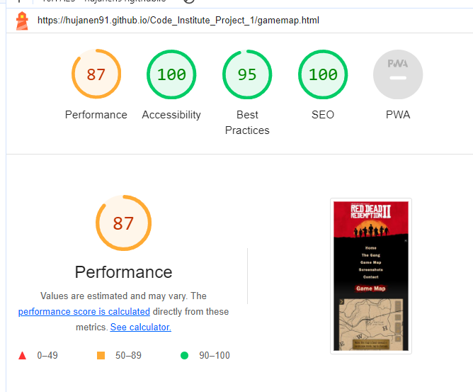

* Lower performance due to the embedded link, cache and issues from the linked map,
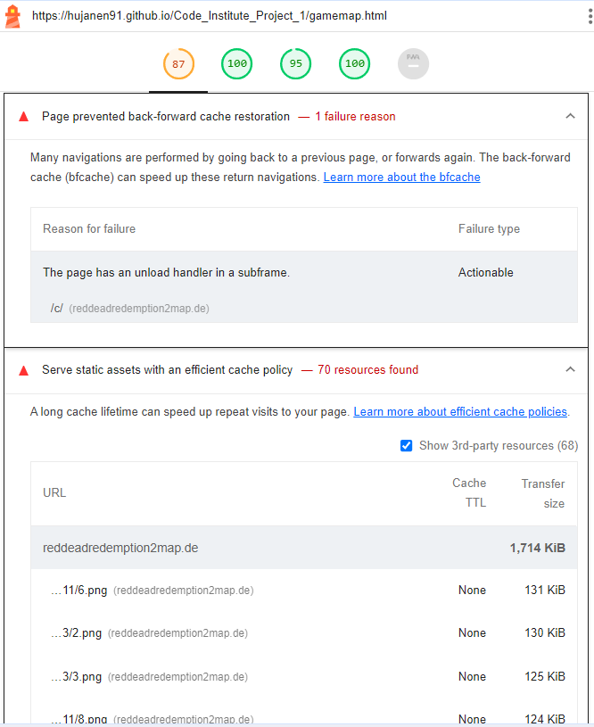

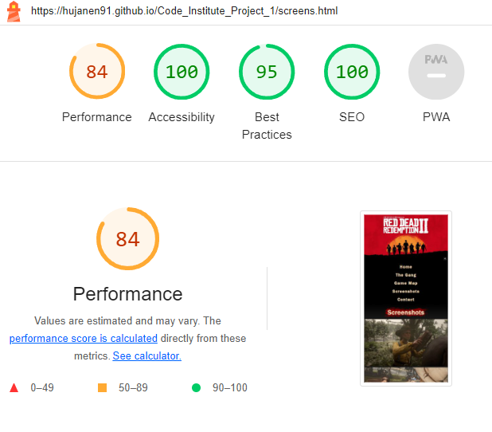

* Screens lower perfomance is due to images being a little bit bigger. I didn't want to resize and compress the images further and loose the quality.

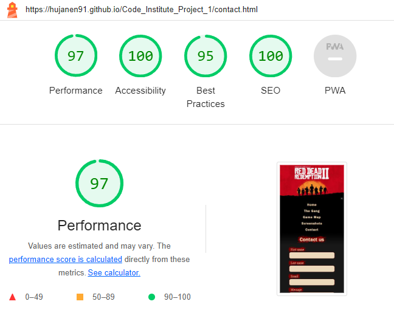

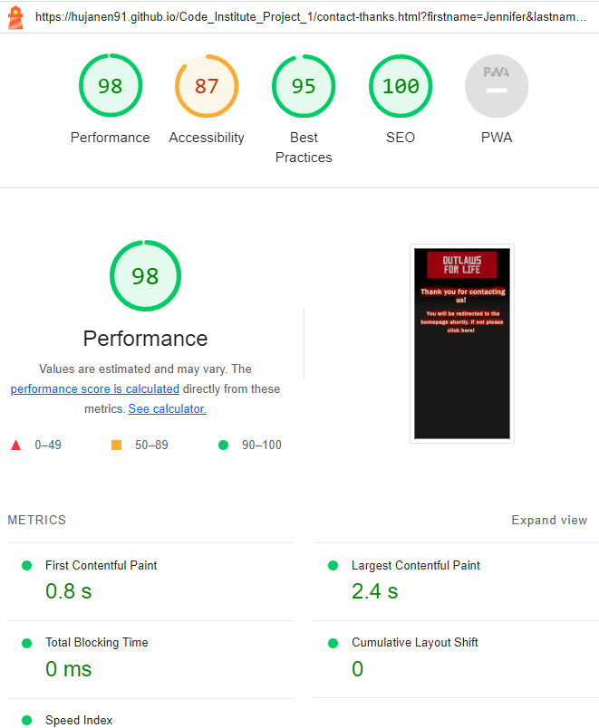

### Functional Testing

#### Navigation Links

Testing was performed to ensure all navigation links on the respective pages, navigated to the correct pages as per design. This was done by clicking on the navigation links on each page.

| Navigation Link | Page to Load    |
| --------------- | --------------- |
| Home            | index.html      |
| The Gang        | thegang.html    |
| Game Map        | gamemap.html    |
| Screenshots     | screens.html    |
| Contact         | contact.html    |

Links on all pages navigated to the correct pages as exptected.

#### Form Testing

The form on the home page was tested to ensure it functioned as expected when correct data was input and when incorrect data was input. The following test scenarios were covered:

#### Scenario One - Correct Inputs

Steps to test:

1. Navigate to [Red Dead Redemption 2 - Contact](https://hujanen91.github.io/Code_Institute_Project_1/contact.html)
2. Scroll down to the form and input the following data:
   * First Name: John
   * Last Name: Doe
   * Email: doe.john@test.com
   * Comment: This is a test.
3. Click Submit
4. User should be redirected to contact-thanks.html confirmation page

Expected:

Form submits with no warnings or errors and user is redirected to contact.html confirmation page.

Actual:

Website behaved as expected with no errors or warnings and redirected to contact.html.

#### Scenario Two - Missing Required Field First Name

Steps to test:

1. Navigate to [Red Dead Redemption 2 - Contact](https://hujanen91.github.io/Code_Institute_Project_1/contact.html)
2. Scroll down to the form and input the following data:
   * First Name:
   * Last Name: Doe
   * Email: doe.john@test.com
   * Comment: This is a test.
3. Click Submit

Expected:

The form does not submit and an Error is displayed to tell the user that the field is required.

Actual:

Website behaved as expected, error message was displayed and the form did not submit.

#### Scenario Three - Missing Required Field Last Name

Steps to test:

1. Navigate to [Red Dead Redemption 2 - Contact](https://hujanen91.github.io/Code_Institute_Project_1/contact.html)
2. Scroll down to the form and input the following data:
   * First Name:John
   * Last Name:
   * Email: doe.john@test.com
   * Comment: This is a test.
3. Click Submit

Expected:

The form does not submit and an Error is displayed to tell the user that the field is required.

Actual:

Website behaved as expected, error message was displayed and the form did not submit.

#### Scenario Four - Missing Required Field Email

Steps to test:

1. Navigate to [Red Dead Redemption 2 - Contact](https://hujanen91.github.io/Code_Institute_Project_1/contact.html)
2. Scroll down to the form and input the following data:
   * First Name:John
   * Last Name: Doe
   * Email:
   * Comment: This is a test.
3. Click Submit

Expected:

The form does not submit and an Error is displayed to tell the user that the field is required.

Actual:

Website behaved as expected, error message was displayed and the form did not submit.

#### Scenario Six - Incorrect email format

Steps to test:

1. Navigate to [Red Dead Redemption 2 - Contact](https://hujanen91.github.io/Code_Institute_Project_1/contact.html)
2. Scroll down to the form and input the following data:
   * First Name:John
   * Last Name: Doe
   * Email: doe.johntest.com
   * Comment: This is a test.
3. Click Submit

Expected:

The form does not submit and an Error is displayed to tell the user that a valid email is required and the format it should be in.

Actual:

Website behaved as expected, error message was displayed and the form did not submit.

#### Footer Social Media Icons / Links

Testing was performed on the Font Awesome Social Media icons in the footer to ensure that each one opened in a new tab.

Each item opened a new tab when clicked.

### Validator Testing

* HTML
  * Few errors of basic mistakes was found when putting the code through the validator. [W3C validator](https://validator.w3.org)

* Home Validator Results
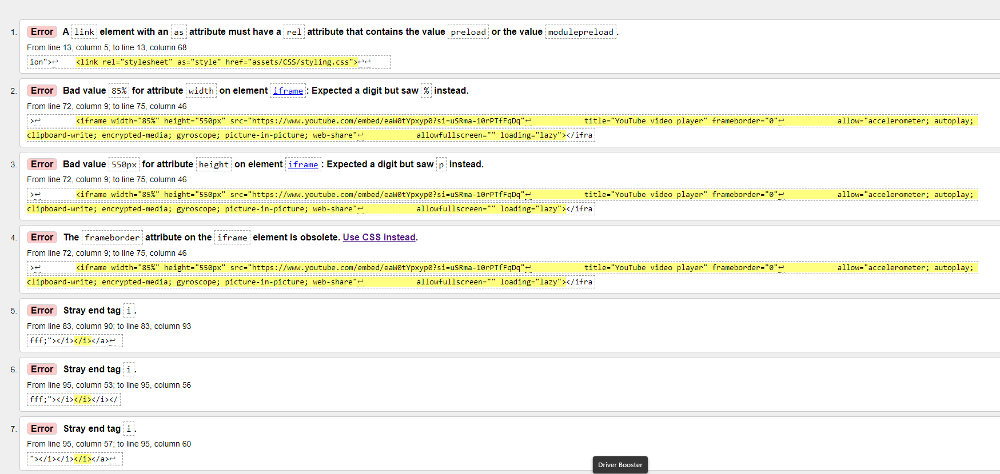
  * Removed Stray end tags, removed "as" attribute in stylesheet, changed % to digits in iframe and corrected the height. Removed frameboard and styled it with css instead.
  * After removing errors the code validated without errors:
  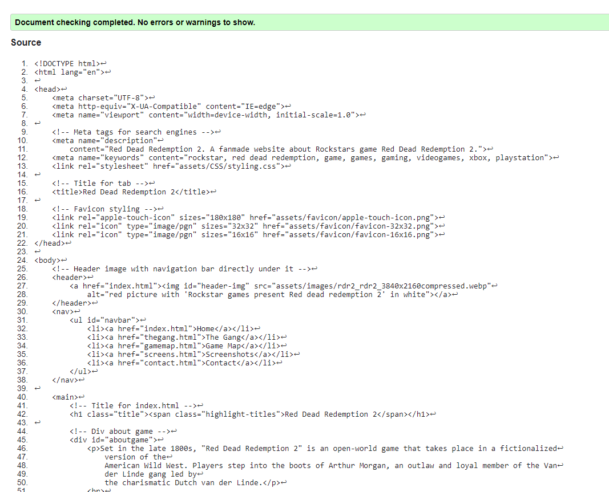
  
* The Gang Validator Results
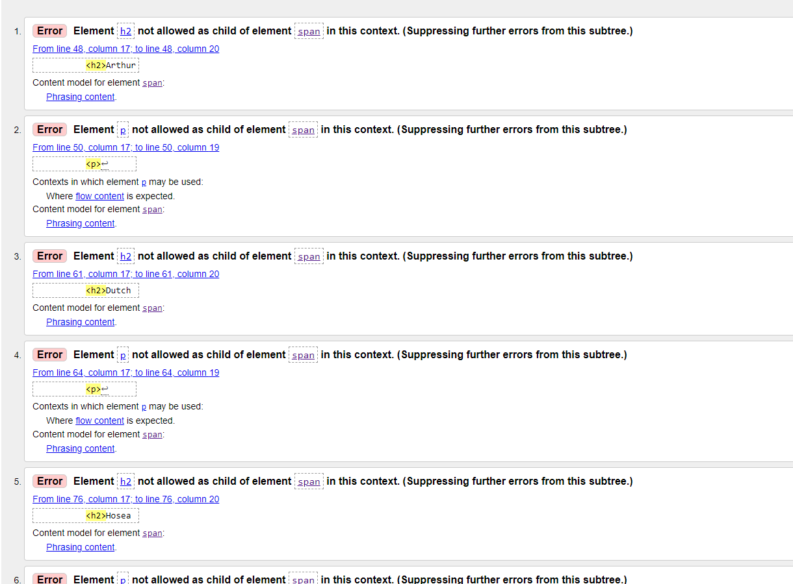
  * Changed span to artical instead and that solved the problem
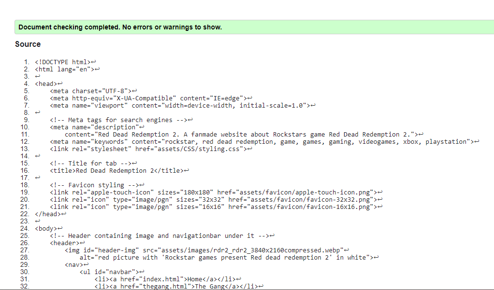

* Game Map Validator Results
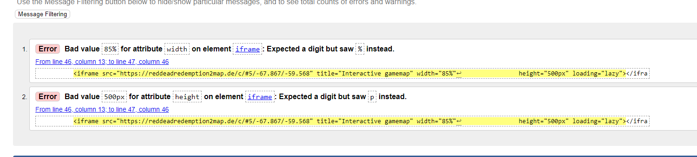
  * Removed width and height attributes and styled them in css instead.
  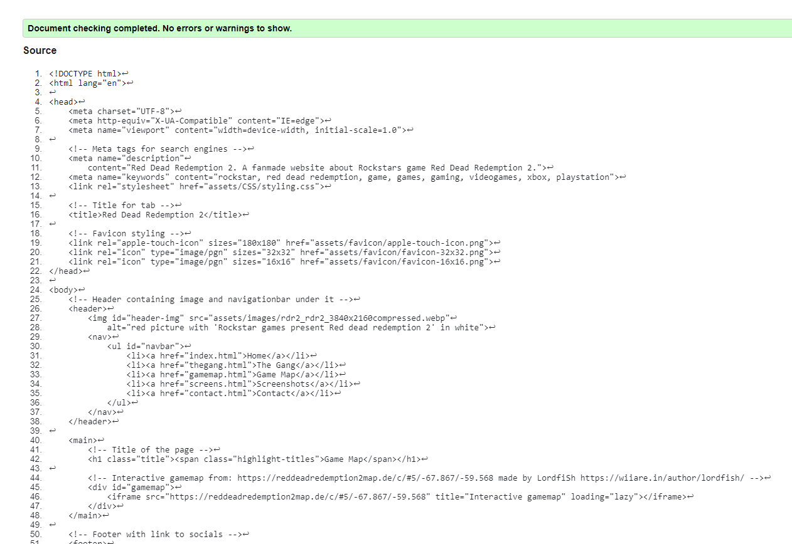

* Screens Validator Results
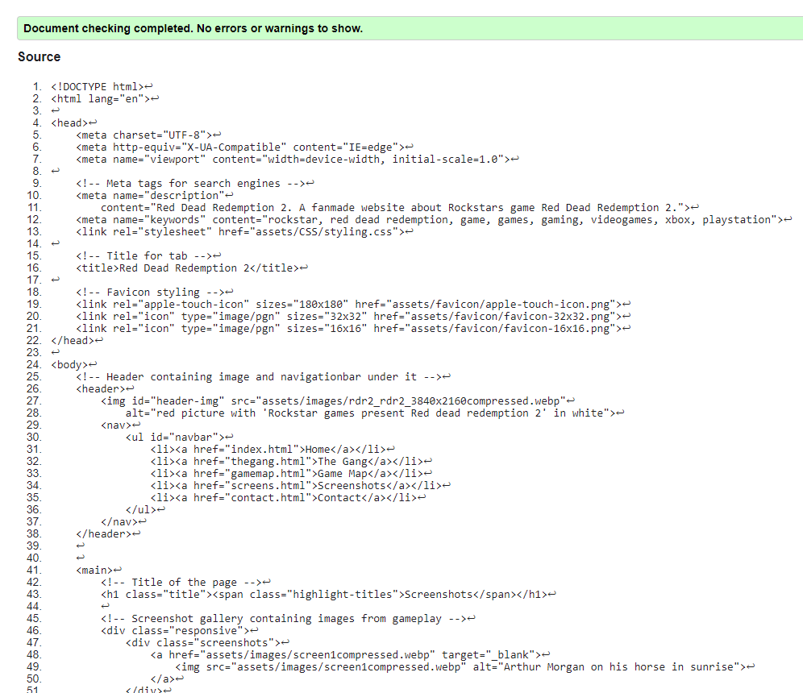

* Contact Validator Results
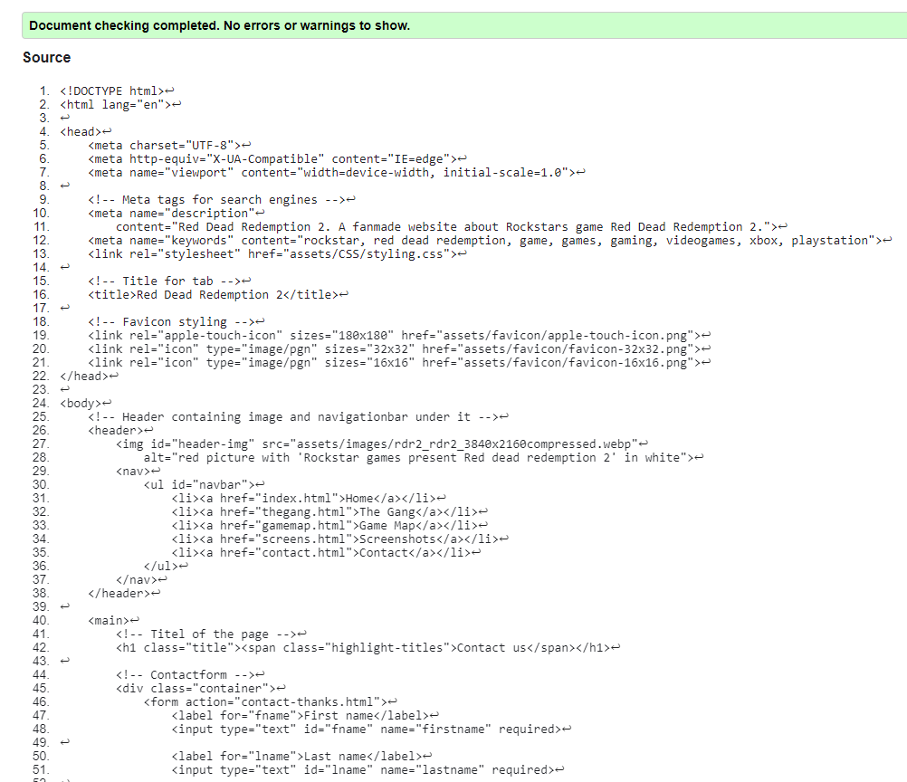

* Contact-thanks Validator Results
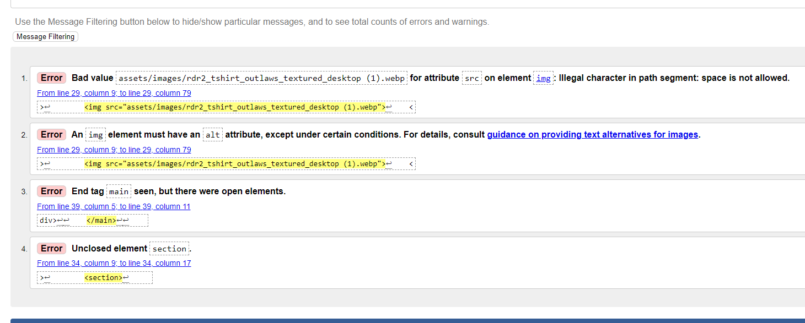
  * Removed space in img src, added an alt attribute to the image, and closed section that was still open.
  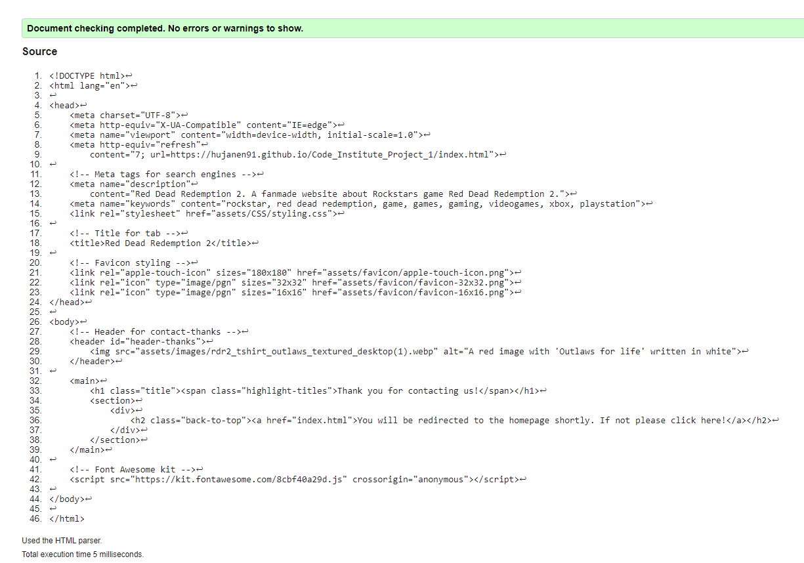

* CSS
  * No errors were found when passing through the official [(Jigsaw) validator](https://jigsaw.w3.org)

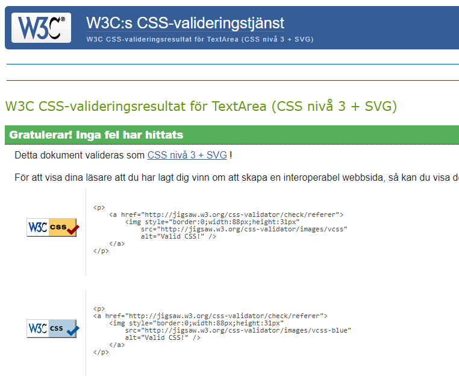

### Bugs

* Had issues with GitHub not being able to show my images properly. Solved this by removing the first "/" in the file name.
* The Screenshots gallery had issues in the beginning not working as I wanted it to, after going through different possible solutions I managed to make it work.
* The navigation bar didn't show in Mozilla Firefox but after moving the nav containing the navitation bar to sit outside and right under header instead of inside the header. This fixed the problem in Mozilla Firefox without changing anything in the other browsers.
* A white line that I didn't seem to be able to get rid off. Managed to solve it by giving the body a background-color.
* The video in index.html was not being as responsive as I wanted it to be. Eventually I realized I needed to change desired width to 100% and height to a desired amount in iframe tag.
* The gang: Had trouble getting the pictures in the right div to align good with the text for said pictures. Eventually realized it was padding-right that was needed.

### Unfixed Bugs

Responsiveness of the website worked on all devices, screen sizes and orientation. The only issue was in mozilla firefox where the brush effect didn't apply as expected on h1 and h2 titles. I tried simple fixes like changing padding etc but didn't get the results I wanted.that would work both on other browsers and on Mozilla Firefox.

## Deployment

### Version Control

The site was created using the Codeanywhere editor and pushed to github to the remote repository ‘Code_Institute_Project_1’.

The following git commands were used throughout development to push code to the remote repo:

```git add <file>``` - This command was used to add the file(s) to the staging area before they are committed.

```git commit -m “commit message”``` - This command was used to commit changes to the local repository queue ready for the final step.

```git push``` - This command was used to push all committed code to the remote repository on github.

### Deployment to Github Pages

* The site was deployed to GitHub pages. The steps to deploy are as follows:
  * In the GitHub repository, navigate to the Settings tab
  * From the menu on left select 'Pages'
  * From the source section drop-down menu, select the Branch: main
  * Click 'Save'
  * A live link will be displayed in a green banner when published successfully.

The live link can be found here - <https://hujanen91.github.io/Code_Institute_Project_1/>

## Credits

* [Title Marker Effekt](https://dev.to/shubhamjain/how-to-create-marker-highlight-effect-in-css-be4) by Shubham Jain
* [Youtube Game Trailer](https://www.youtube.com/watch?v=eaW0tYpxyp0&t=64s)

* [Interactive Map in Game Map](https://reddeadredemption2map.de/c/#4/-68.32/-53.83)
* Images used in The Gang and header are downloaded from [Rockstar Games Download page](https://www.rockstargames.com/reddeadredemption2/downloads)
  * Images from Download at Rockstar Games webpage is free to download and use as long as it's non-commercial.
* [Gallery-layout](https://www.w3schools.com/css/css_image_gallery.asp) was inspired from W3Schools.

### Content

All the images on the Screenshots page is taken by me [Jennifer Hujanen](https://github.com/Hujanen91) during gameplay of Rockstar Games Red Dead Redemption 2.
